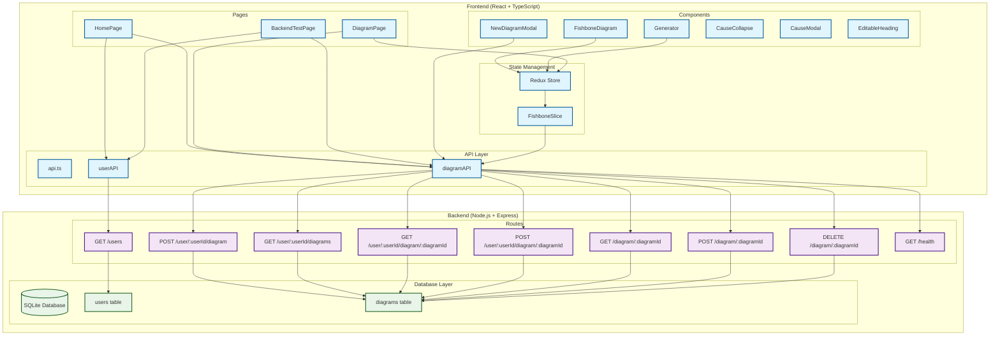

# Fishbone Diagram Creator - API Architecture

## System Overview
This diagram shows the relationship between backend API endpoints and frontend components in the Fishbone Diagram Creator application.



## API Endpoint Details

### User Management
| Endpoint | Method | Purpose | Frontend Usage |
|----------|--------|---------|----------------|
| `/users` | GET | Retrieve all users | HomePage, BackendTestPage |

### Diagram Management
| Endpoint | Method | Purpose | Frontend Usage |
|----------|--------|---------|----------------|
| `/user/:userId/diagram` | POST | Create new diagram | NewDiagramModal |
| `/user/:userId/diagrams` | GET | Get all diagrams for a user | HomePage, BackendTestPage |
| `/user/:userId/diagram/:diagramId` | GET | Get specific diagram by user and ID | BackendTestPage |
| `/user/:userId/diagram/:diagramId` | POST | Update diagram by user and ID | Not directly used |
| `/diagram/:diagramId` | GET | Get diagram by ID only | DiagramPage, FishboneSlice |
| `/diagram/:diagramId` | POST | Update diagram by ID only | FishboneSlice (all mutations) |
| `/diagram/:diagramId` | DELETE | Delete diagram by ID | HomePage |

### System
| Endpoint | Method | Purpose | Frontend Usage |
|----------|--------|---------|----------------|
| `/health` | GET | Health check | Available in API service |

## Data Flow

### 1. Diagram Creation Flow
```
NewDiagramModal → diagramAPI.createDiagram() → POST /user/:userId/diagram → Database → Navigate to new diagram
```

### 2. Diagram Loading Flow
```
DiagramPage → Redux fetchDiagram → diagramAPI.getById() → GET /diagram/:diagramId → Database → Update Redux state → Render FishboneDiagram
```

### 3. Diagram Update Flow
```
Generator Component → Redux action (addCause/updateCause/etc.) → diagramAPI.updateDiagram() → POST /diagram/:diagramId → Database → Update Redux state → Re-render components
```

### 4. Home Page Flow
```
HomePage → userAPI.getAll() → GET /users → For each user: diagramAPI.getByUserId() → GET /user/:userId/diagrams → Display all diagrams
```

## Key Frontend Components and Their API Usage

- **HomePage**: Lists all users and their diagrams, handles diagram deletion
- **DiagramPage**: Loads and displays a specific diagram for editing
- **NewDiagramModal**: Creates new diagrams
- **Generator**: Provides editing interface, triggers Redux actions for diagram updates
- **FishboneDiagram**: Renders the visual diagram, receives data from Redux store

## State Management Pattern

The application uses Redux Toolkit with async thunks:
- All diagram mutations go through Redux actions
- Actions call the API and update the store
- Components subscribe to store changes
- Optimistic updates are handled in the Redux slice

## Database Schema

- **users**: id, name
- **diagrams**: id, user_id, problem, causes (JSON string)

The causes field stores a hierarchical structure of causes and sub-causes as a JSON string, which is parsed on the frontend for display and editing.
