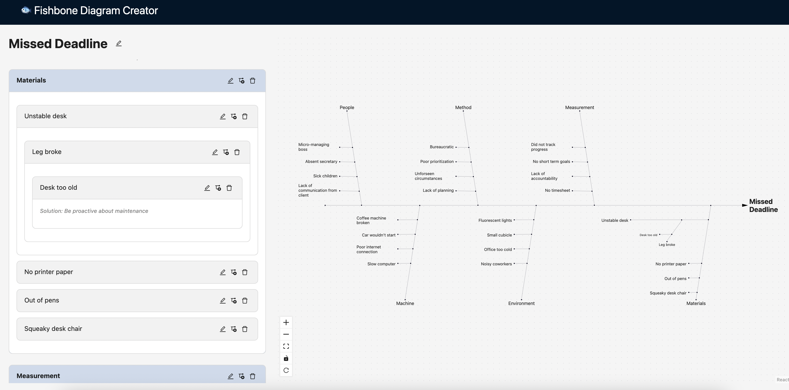

# Fishbone Diagram Creator

A full-stack application for creating and managing fishbone diagrams (aka. Ishikawa diagrams, aka. cause-and-effect diagrams) with a React frontend and Express.js backend.

GenAI was used to help build this application, primarily the backend server.

Screenshot:


Note:
- The rendering of the fishbone diagram is handled by https://github.com/hophiphip/react-fishbone which in turn uses [React Flow](https://reactflow.dev/).
- 

## Features

### Frontend
- **Interactive Fishbone Diagrams**: Create, edit, and visualize cause-and-effect relationships
- **Clean UI**: Built with React, TypeScript, and Ant Design
- **State Management**: Redux Toolkit for application state
- **Responsive Design**: Works on desktop and mobile devices

### Backend
- **Express.js Server**: RESTful API endpoints
- **SQLite Database**: Local database with automatic schema creation
- **User Management**: Store and retrieve user information
- **Diagram Persistence**: Save and load fishbone diagrams
- **Seed Data**: Pre-populated with sample users and diagrams

## Project Structure

```
fishbone-diagram-creator/
├── src/                    # Frontend React application
│   ├── components/         # React components
│   ├── slices/            # Redux slices
│   ├── services/          # API services
│   └── ...
├── backend/               # Express.js backend server
│   ├── src/              # TypeScript source code
│   ├── db/               # SQLite database files
│   └── package.json      # Backend dependencies
└── package.json          # Frontend dependencies
```

## Quick Start

### Prerequisites
- Node.js (v18 or higher)
- npm or yarn

### 1. Install Dependencies

```bash
# Install frontend dependencies
npm install

# Install backend dependencies
cd backend
npm install
cd ..
```

### 2. Start the Application

#### Option A: Start Both Servers (Recommended)
```bash
npm run dev:full
```

NOTE: If the SQLite database does not exist, it will automatically be created and preloaded with seed data

This will start:
- Frontend: http://localhost:5173 (or next available port)
- Backend: http://localhost:3001

#### Option B: Start Servers Separately

**Terminal 1 - Frontend:**
```bash
npm run dev
```

**Terminal 2 - Backend:**
```bash
cd backend
npm run dev
```

### 3. Access the Application

- **Main App**: http://localhost:5173
- **New Diagram**: http://localhost:5173/new
- **Backend Test**: http://localhost:5173/backend-test
- **API Health Check**: http://localhost:3001/health

## Backend API Endpoints

### Users
- `GET /users` - Get all users

### Diagrams
- `GET /user/{user_id}/diagrams` - Get all diagrams for a user
- `GET /user/{user_id}/diagram/{diagram_id}` - Get specific diagram with parsed causes

### Health
- `GET /health` - Server health check

## Database Schema

### Users Table
- `id` (TEXT, PRIMARY KEY): UUID for user identification
- `name` (TEXT): User's display name

### Diagrams Table
- `id` (TEXT, PRIMARY KEY): UUID for diagram identification
- `user_id` (TEXT, FOREIGN KEY): Reference to users table
- `problem` (TEXT): The main problem statement
- `causes` (TEXT): JSON blob containing the causes structure

## Seed Data

The backend automatically creates:
- 5 sample users (Alice, Bob, Carol, David, Eva)
- 1 sample diagram for the first user with realistic fishbone data

## Development

### Frontend Development
```bash
npm run dev          # Start Vite dev server
npm run build        # Build for production
```

### Backend Development
```bash
cd backend
npm run dev          # Start with nodemon (auto-restart)
npm run build        # Build TypeScript
npm start            # Start production build
```

### Database
- SQLite database file: `backend/db/fishbone.db`
- Database is automatically created and seeded on first run
- Schema is automatically created if it doesn't exist

## Technologies Used

### Frontend
- React 18 with TypeScript
- Redux Toolkit for state management
- Ant Design for UI components
- React Router for navigation
- Vite for build tooling

### Backend
- Express.js with TypeScript
- SQLite3 for database

